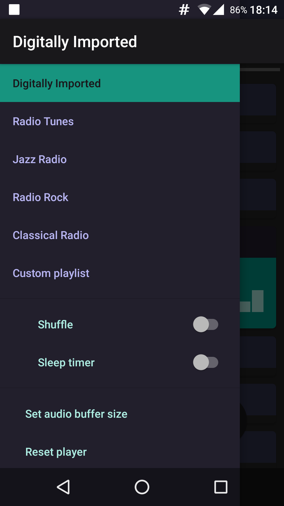
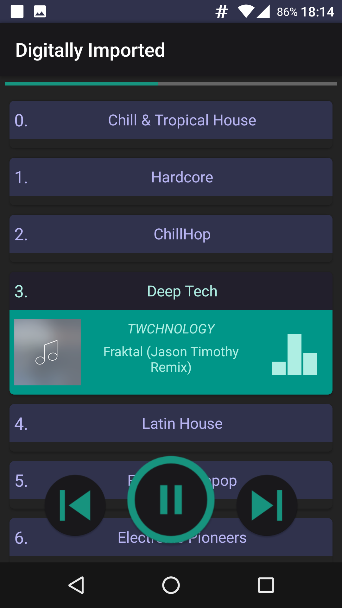

<h4>
Android application for playing online audio streams. 
</h4>
<h3>
<a href="https://app.box.com/s/z32stlza8ub4ek2180z68f98172duqhx"> Download apk version 2.5</a>
</h3>

<h1>Features:</h1>
<ul>
  <li>Auto resume interrupted playback when internet connection reestablished</li>
  <li>Set custom audio buffer size</li>
  <li>Audio buffer progress animation</li>
  <li>Handle Audiofocus change</li>
  <li>Handle Audio device added/removed</li>
  <li>Status bar notification</li>
  <li>Sleep timer</li>
  <li>Show audiotrack metadata</li>
</ul>
<h1>Used frameworks:</h1>
<ul>
  <li><a href="https://github.com/goldblade/cordova-plugin-aacdecoder-android">cordova-plugin-aacdecoder-android</a></li>
  <li><a href="https://github.com/greenrobot/EventBus">EventBus</a></li>
  <li><a href="https://github.com/pwittchen/ReactiveNetwork">ReactiveNetwork</a></li>
  <li><a href="https://github.com/cantrowitz/RxBroadcast">RxBroadcast</a></li>
</ul>

<b>P.S. </b> Feel free to suggest features and report bugs. 

